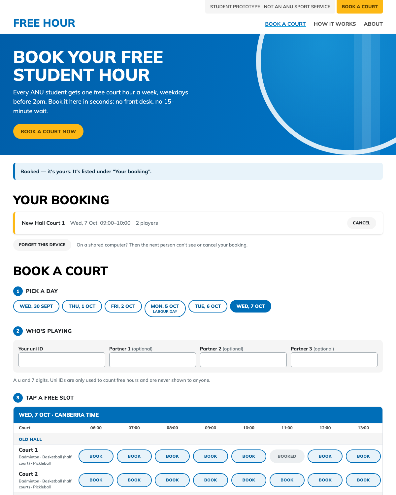

# Free Hour

Free Hour lets ANU students book their free weekly court hour online. ANU
Sport gives every student one free hour a week, weekdays before 2pm, on its
badminton, basketball, pickleball, squash and tennis courts or the cricket
nets. The only way to claim it is at the front desk, with a student card, no
earlier than 15 minutes before the slot. Here you see which courts are free
over the next seven days, enter your uni ID (and your partners'), and tap a
slot. This is a COMP4020 prototype, not an ANU Sport service, and bookings
made here are not real.

## The system it replaces

I've tried booking through ANU Sport's website. The place to book is hard to
find, and awkward once you're there. The free hour is the sharpest case:

- The homepage says "ANU Students can hire facilities FREE before 2pm for an
  hour every week". Its "Hire a Facility" button leads to online booking. But
  the [Student Benefits page](https://anu-sport.com.au/student-services/benefits)
  says the free hour can't be booked online at all (quoted as published):

  > This is only applicable to walk in bookings, and valid student IDs must
  > be presented at the time of booking. Bookings cannot be made more then 15
  > minutes before the desired slot. All participants must be ANU Students
  > with valid student IDs. groups cannot book multiple, consecutive hours.

- The [Halls and Courts page](https://anu-sport.com.au/pages/73) says
  something else again: "ANU Students can hire indoor facilities for free
  before 2pm!"
- Paid bookings need an account on a separate third-party portal. The free
  hour can't be booked there.

## What good looks like here

- **Booking is the first thing you see.** The homepage opens on a "Book a
  court now" button. A yellow "Book a court" tab sits in the corner of every
  page, where ANU Sport keeps its timetable tab. Booking takes three numbered
  steps: pick a day, say who's playing, tap a free slot. There's no login,
  just a uni ID and a tap.
- **The rules are written once, in plain language, and the database enforces
  them instead of a person at a desk.** The schema refuses:
  - a slot that's already booked;
  - a second free hour in a week for any listed player;
  - weekends, and slots outside 6am–2pm;
  - impossible dates and malformed uni IDs.

  The server checks the rules that depend on the clock: not started, at most
  seven days ahead, and after 9am on public holidays. It checks them in
  Canberra time, because the server runs in UTC.
- **You can plan ahead:** seven days instead of fifteen minutes.
- **Every listed player uses their free hour.** That's my reading of ANU
  Sport's group rules, and it's stricter than their wording. In exchange, a
  group can't chain hours at all.
- **It works without JavaScript.** Every action is a form post, and open pages
  update live when JavaScript runs.
- **It's accessible and works on a phone.** The grid has real table headers,
  each slot button's spoken name says which court and hour it books, and the
  court column stays put on narrow screens.
- **It looks like part of ANU Sport**, so students recognise where they are.
  It uses the same Mulish type, blue, yellow pill buttons and uppercase
  headings. Three of ANU Sport's own colour pairs fail WCAG AA contrast:
  - the yellow buttons' text (4.15:1);
  - the light-blue current-page link (2.64:1);
  - white on the light-blue banner (2.16:1).

  Those colours are darkened here. There's no ANU Sport logo or name on the
  page, and every page says it's a student prototype.
- **It's private.** Uni IDs are used only to count free hours. They are never
  shown on a page or put in a cookie. A random device token lets the booker
  cancel, and "Forget this device" clears it on a shared computer.

While deciding, I read these ANU Sport pages: the homepage, Student Benefits,
Halls and Courts, Ovals and Fields, the Gym page, the price list, and the
booking portal.

### What the checks enforce, and what's judged

`spec/booking.test.ts` drives the built server the way a browser does. It
checks that:

- a booking survives a reload and a server restart;
- a booking shows as taken to everyone and as yours to you;
- a slot can't be booked twice;
- each student gets one free hour a week, with partners counted;
- only the booking device can cancel, and cancelling returns the slot and the
  hours;
- no uni ID reaches a cookie or a page;
- new bookings reach the live stream.

`spec/time.test.ts` pins the Canberra clock across daylight saving.
`spec/links.test.ts` runs the deploy's link check locally. The invariants hold
the accessibility floor.

For the crit to judge:

- whether it's actually easier than the desk;
- whether the rules read clearly;
- how closely it should follow ANU Sport's look;
- whether counting every player is the right reading of the rule;
- the modelling below.

## Modelling choices, and what's left out

The ten facilities are ANU Sport's own:

- Old Hall and New Hall, two courts each;
- two squash courts;
- tennis courts at South Oval, Mills Road and Old Canberra House (one court
  each, since ANU Sport doesn't publish how many there are);
- the cricket nets at South Oval.

Slots are whole hours from 6am, when the halls open, to 2pm, or from 9am on
ACT public holidays. A week runs from Monday to Sunday.

Not built:

- payments and paid bookings;
- a real ANU login;
- the front desk's side (check-in, no-shows);
- the gym timetable;
- confirmation emails;
- waitlists.

These are all real parts of the system, but none is needed to show that the
free hour can be booked online.
